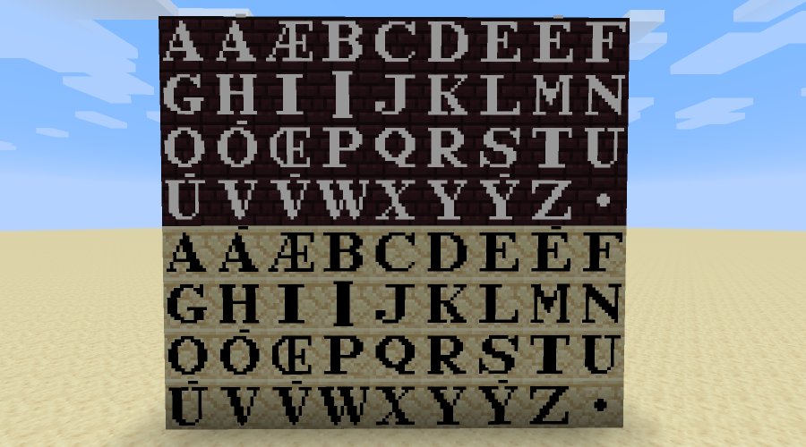

# Letter Blocks for Minecraft

Adds letter blocks for making inscriptions on buildings.

Has all 26 letters of the ISO standard Latin alphabet, as well as the letters A, E, I, O, U, V, and Y with the
[apex](https://en.wikipedia.org/wiki/Apex_\(diacritic\)) diacritic, the ligatures Æ and Œ, and an interpunct
for separating words in the Roman style.

They're not craftable (yet). I'll add a way to get them in Survival when I get around to it.

